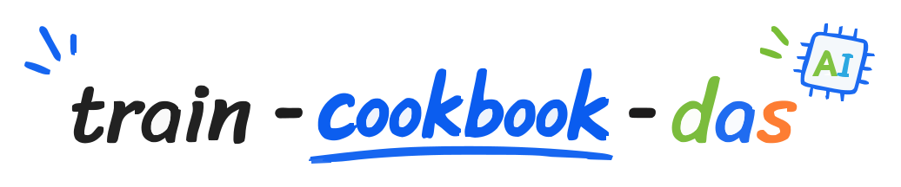

<picture>
  <source media="(prefers-color-scheme: dark)" srcset="./assets/train-cookbook-das-dark.svg">
  
</picture>

## 📖 简介

本仓库整理了在 HCU 硬件上训练、调优和运行 AI 模型的经验与最佳实践，涵盖：

- **大语言模型 (LLM)** — 文本生成、对话、代码补全等
- **多模态模型 (VLM)** — 视觉语言模型、图像生成等
- **Physical AI** — 面向真实物理环境的感知、推理、决策与控制

## 📋 模型列表(绿色对勾可点击)

✅ 已验证 &nbsp;|&nbsp; 🚧 开发中 &nbsp;|&nbsp; `-` 暂未验证

### 大模型

<table align="center">
  <thead>
    <tr>
      <th rowspan="2">类型</th>
      <th rowspan="2">模型</th>
      <th colspan="2" style="text-align:center"><a href="https://github.com/HYGON-AI/Megatron-LM-das">Megatron-LM-DAS</a></th>
      <th colspan="2" style="text-align:center"><a href="https://github.com/HYGON-AI/verl-das">VERL-DAS</a></th>
      <th colspan="2" style="text-align:center"><a href="https://github.com/hiyouga/LLaMAFactory">LlamaFactory</a></th>
      <th colspan="2" style="text-align:center"><a href="https://github.com/HYGON-AI/slime-das">SLIME-DAS</a></th>
    </tr>
    <tr>
      <th align="center">BW1000</th>
      <th align="center">BW1100</th>
      <th align="center">BW1000</th>
      <th align="center">BW1100</th>
      <th align="center">BW1000</th>
      <th align="center">BW1100</th>
      <th align="center">BW1000</th>
      <th align="center">BW1100</th>
    </tr>
  </thead>
  <tbody>
    <tr>
      <td rowspan="17">Large Language Models (LLM)</td>
      <td>DeepSeek v3</td>
      <td align="center"><a href="docs/model-framework/megatron/BW1000/DeepSeek-3.md">✅</a></td>
      <td align="center"><a href="docs/model-framework/megatron/BW1100/DeepSeek-3.md">✅</a></td>
      <td align="center">-</td>
      <td align="center">-</td>
      <td align="center">-</td>
      <td align="center">-</td>
      <td align="center">-</td>
      <td align="center">-</td>
    </tr>
    <tr>
      <td>Gemma 2</td>
      <td align="center">-</td>
      <td align="center">-</td>
      <td align="center">-</td>
      <td align="center">-</td>
      <td align="center">-</td>
      <td align="center">-</td>
      <td align="center">-</td>
      <td align="center">-</td>
    </tr>
    <tr>
      <td>Gemma 3</td>
      <td align="center"><a href="docs/model-framework/megatron/BW1000/Gemma-3.md">✅</a></td>
      <td align="center">🚧</td>
      <td align="center">-</td>
      <td align="center">-</td>
      <td align="center">-</td>
      <td align="center">-</td>
      <td align="center">-</td>
      <td align="center">-</td>
    </tr>
    <tr>
      <td>Gemma 4</td>
      <td align="center">-</td>
      <td align="center">-</td>
      <td align="center">-</td>
      <td align="center">-</td>
      <td align="center">-</td>
      <td align="center">-</td>
      <td align="center">-</td>
      <td align="center">-</td>
    </tr>
    <tr>
      <td>GLM-4.5</td>
      <td align="center">-</td>
      <td align="center">-</td>
      <td align="center">-</td>
      <td align="center">-</td>
      <td align="center">-</td>
      <td align="center">-</td>
      <td align="center">-</td>
      <td align="center">-</td>
    </tr>
    <tr>
      <td>GLM-5</td>
      <td align="center">🚧</td>
      <td align="center">🚧</td>
      <td align="center">-</td>
      <td align="center">-</td>
      <td align="center">-</td>
      <td align="center">-</td>
      <td align="center"><a href="docs/model-framework/slime-das/BW1000/LLM/GLM-5.md">✅</a></td>
      <td align="center">-</td>
    </tr>
    <tr>
      <td>GLM-5.2</td>
      <td align="center"><a href="docs/model-framework/megatron/BW1000/GLM-5.2.md">✅</a></td>
      <td align="center">🚧</td>
      <td align="center">-</td>
      <td align="center">-</td>
      <td align="center">-</td>
      <td align="center">-</td>
      <td align="center">-</td>
      <td align="center">-</td>
    </tr>
    <tr>
      <td>GPT-3</td>
      <td align="center">🚧</td>
      <td align="center">🚧</td>
      <td align="center">-</td>
      <td align="center">-</td>
      <td align="center">-</td>
      <td align="center">-</td>
      <td align="center">-</td>
      <td align="center">-</td>
    </tr>
    <tr>
      <td>GPT-oss</td>
      <td align="center">-</td>
      <td align="center">-</td>
      <td align="center">-</td>
      <td align="center">-</td>
      <td align="center">-</td>
      <td align="center">-</td>
      <td align="center">-</td>
      <td align="center">-</td>
    </tr>
    <tr>
      <td>Kimi K2</td>
      <td align="center">-</td>
      <td align="center">-</td>
      <td align="center">-</td>
      <td align="center">-</td>
      <td align="center">-</td>
      <td align="center">-</td>
      <td align="center">-</td>
      <td align="center">-</td>
    </tr>
    <tr>
      <td>Llama 2/3</td>
      <td align="center"><a href="docs/model-framework/megatron/BW1000/Llama.md">✅</a></td>
      <td align="center"><a href="docs/model-framework/megatron/BW1100/Llama.md">✅</a></td>
      <td align="center">-</td>
      <td align="center">-</td>
      <td align="center">-</td>
      <td align="center">-</td>
      <td align="center">-</td>
      <td align="center">-</td>
    </tr>
    <tr>
      <td>Qwen 1.5</td>
      <td align="center"><a href="docs/model-framework/megatron/BW1000/Qwen-1.5.md">✅</a></td>
      <td align="center">🚧</td>
      <td align="center">-</td>
      <td align="center">-</td>
      <td align="center">-</td>
      <td align="center">-</td>
      <td align="center">-</td>
      <td align="center">-</td>
    </tr>
    <tr>
      <td>Qwen 2/2.5</td>
      <td align="center"><a href="docs/model-framework/megatron/BW1000/Qwen-2.md">✅</a></td>
      <td align="center">🚧</td>
      <td align="center">-</td>
      <td align="center"><a href="docs/model-framework/verl/BW1100/LLM/Qwen-2.md">✅</a></td>
      <td align="center">-</td>
      <td align="center">-</td>
      <td align="center">-</td>
      <td align="center">-</td>
    </tr>
    <tr>
      <td>Qwen 3</td>
      <td align="center"><a href="docs/model-framework/megatron/BW1000/Qwen-3.md">✅</a></td>
      <td align="center"><a href="docs/model-framework/megatron/BW1100/Qwen-3.md">✅</a></td>
      <td align="center">-</td>
      <td align="center"><a href="docs/model-framework/verl/BW1100/LLM/Qwen-3.md">✅</a></td>
      <td align="center">-</td>
      <td align="center">-</td>
      <td align="center"><a href="docs/model-framework/slime-das/BW1000/LLM/Qwen-3.md">✅</a></td>
      <td align="center">-</td>
    </tr>
    <tr>
      <td>Qwen3-Next</td>
      <td align="center"><a href="docs/model-framework/megatron/BW1000/Qwen3-Next.md">✅</a></td>
      <td align="center">🚧</td>
      <td align="center">-</td>
      <td align="center">-</td>
      <td align="center">-</td>
      <td align="center">-</td>
      <td align="center">-</td>
      <td align="center">-</td>
    </tr>
  </tbody>
  <tbody>
    <tr>
      <td rowspan="6">Vision Language Models (VLM)</td>
      <td>Gemma 3-VL</td>
      <td align="center"><a href="docs/model-framework/megatron/BW1000/Gemma-3-VL.md">✅</a></td>
      <td align="center">🚧</td>
      <td align="center">-</td>
      <td align="center">-</td>
      <td align="center">-</td>
      <td align="center">-</td>
      <td align="center">-</td>
      <td align="center">-</td>
    </tr>
    <tr>
      <td>Gemma 4-VL</td>
      <td align="center">-</td>
      <td align="center">-</td>
      <td align="center">-</td>
      <td align="center">-</td>
      <td align="center">-</td>
      <td align="center">-</td>
      <td align="center">-</td>
      <td align="center">-</td>
    </tr>
    <tr>
      <td>GLM 4.5-VL</td>
      <td align="center">-</td>
      <td align="center">-</td>
      <td align="center">-</td>
      <td align="center">-</td>
      <td align="center">-</td>
      <td align="center">-</td>
      <td align="center">-</td>
      <td align="center">-</td>
    </tr>
    <tr>
      <td>Qwen 2/2.5-VL</td>
      <td align="center"><a href="docs/model-framework/megatron/BW1000/Qwen-2-VL.md">✅</a></td>
      <td align="center"><a href="docs/model-framework/megatron/BW1100/Qwen-2-VL.md">✅</a></td>
      <td align="center">-</td>
      <td align="center">-</td>
      <td align="center">-</td>
      <td align="center">-</td>
      <td align="center">-</td>
      <td align="center">-</td>
    </tr>
    <tr>
      <td>Qwen 3-VL</td>
      <td align="center"><a href="docs/model-framework/megatron/BW1000/Qwen-3-VL.md">✅</a></td>
      <td align="center"><a href="docs/model-framework/megatron/BW1100/Qwen-3-VL.md">✅</a></td>
      <td align="center">-</td>
      <td align="center"><a href="docs/model-framework/verl/BW1100/VLM/Qwen-3-VL.md">✅</a></td>
      <td align="center">-</td>
      <td align="center">-</td>
      <td align="center">-</td>
      <td align="center">-</td>
    </tr>
    <tr>
      <td>Qwen 3.5-VL</td>
      <td align="center"><a href="docs/model-framework/megatron/BW1000/Qwen-3.5-VL.md">✅</a></td>
      <td align="center"><a href="docs/model-framework/megatron/BW1100/Qwen-3.5-VL.md">✅</a></td>
      <td align="center">-</td>
      <td align="center">-</td>
      <td align="center">-</td>
      <td align="center">-</td>
      <td align="center">-</td>
      <td align="center">-</td>
    </tr>
  </tbody>
</table>

### 多模态生成模型

<table align="center">
  <thead>
    <tr>
      <th rowspan="2">类型</th>
      <th rowspan="2">模型</th>
      <th colspan="2" style="text-align:center"><a href="https://github.com/modelscope/DiffSynth-Studio">DiffSynth-Studio</a></th>
    </tr>
    <tr>
      <th align="center">BW1000</th>
      <th align="center">BW1100</th>
    </tr>
  </thead>
  <tbody>
    <tr>
      <td rowspan="14">Omni-modal Generation Model</td>
      <td>MiniMax-H3</td>
      <td align="center"><a href="docs/model-framework/DiffSynthStudio/BW1000/MiniMax-H3.md">✅</a></td>
      <td align="center">-</td>
    </tr>
  </tbody>
</table>

### Physical AI

面向 Physical AI 模型方向，涵盖自动驾驶、具身智能与世界模型

<table align="center">
  <thead>
    <tr>
      <th>类型</th>
      <th>模型</th>
      <th align="center">BW1000</th>
      <th align="center">BW1100</th>
    </tr>
  </thead>
  <tbody>
    <tr>
      <td rowspan="6">Autonomous Driving Models (ADM)</td>
      <td>Bevformer</td>
      <td align="center"><a href="docs/model-framework/mmcv/BW1000/Bevformer.md">✅</a></td>
      <td align="center"><a href="docs/model-framework/mmcv/BW1100/Bevformer.md">✅</a></td>
    </tr>
    <tr>
      <td>Maptrv2</td>
      <td align="center"><a href="docs/model-framework/mmcv/BW1000/Maptrv2.md">✅</a></td>
      <td align="center"><a href="docs/model-framework/mmcv/BW1100/Maptrv2.md">✅</a></td>
    </tr>
    <tr>
      <td>Sparse4d</td>
      <td align="center"><a href="docs/model-framework/mmcv/BW1000/Sparse4d.md">✅</a></td>
      <td align="center"><a href="docs/model-framework/mmcv/BW1100/Sparse4d.md">✅</a></td>
    </tr>
    <tr>
      <td>Pointpillars</td>
      <td align="center"><a href="docs/model-framework/mmcv/BW1000/Pointpillars.md">✅</a></td>
      <td align="center"><a href="docs/model-framework/mmcv/BW1100/Pointpillars.md">✅</a></td>
    </tr>
    <tr>
      <td>Flashocc</td>
      <td align="center"><a href="docs/model-framework/mmcv/BW1000/Flashocc.md">✅</a></td>
      <td align="center"><a href="docs/model-framework/mmcv/BW1100/Flashocc.md">✅</a></td>
    </tr>
    <tr>
      <td>Bevfusion</td>
      <td align="center"><a href="docs/model-framework/mmcv/BW1000/Bevfusion.md">✅</a></td>
      <td align="center"><a href="docs/model-framework/mmcv/BW1100/Bevfusion.md">✅</a></td>
    </tr>
    <tr>
      <td rowspan="4">Vision-Language-Action Models (VLA)</td>
      <td>π0.5</td>
      <td align="center">🚧</td>
      <td align="center">🚧</td>
    </tr>
    <tr>
      <td>GR00T-N1.7</td>
      <td align="center">🚧</td>
      <td align="center">🚧</td>
    </tr>
    <tr>
      <td>OpenVLA</td>
      <td align="center">🚧</td>
      <td align="center">🚧</td>
    </tr>
    <tr>
      <td>StarVLA</td>
      <td align="center">🚧</td>
      <td align="center">🚧</td>
    </tr>
    <tr>
      <td rowspan="1">World Models (WM)</td>
      <td>Fast-WAM</td>
      <td align="center">🚧</td>
      <td align="center">🚧</td>
    </tr>
  </tbody>
</table>

## 快速开始
在 HCU 上运行一个 AI 模型，请参考：
- [Megatron-LM-das 快速开始](https://github.com/HYGON-AI/Megatron-LM-das)。
- [Verl-das 快速开始](https://github.com/HYGON-AI/verl-das)。
- [Slime-das 快速开始](docs/framework/slime-das.md)。
- [ms-swift 快速开始(暂无)]()。
- [llamafactory 快速开始(暂无)]()。
- [mmcv 快速开始(暂无)]()。
- [diffsynthstudio 快速开始](./docs/framework/diffsynthstudio.md)。

## 📄 许可证与第三方来源

本项目采用 [MIT License](LICENSE)。

仓库不直接内嵌第三方源码。文档中引用的模型、推理框架、工具和服务仍由各自项目的许可证约束，具体说明见 [THIRD_PARTY_NOTICES.md](THIRD_PARTY_NOTICES.md)。

## 🤝 贡献

欢迎提交 Issue 和 PR！详见 [CONTRIBUTING.md](CONTRIBUTING.md)。
